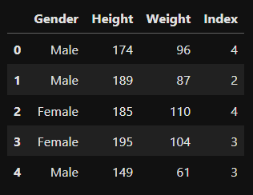

# EXNO:4-DS
# AIM:
To read the given data and perform Feature Scaling and Feature Selection process and save the
data to a file.

# ALGORITHM:
STEP 1:Read the given Data.
STEP 2:Clean the Data Set using Data Cleaning Process.
STEP 3:Apply Feature Scaling for the feature in the data set.
STEP 4:Apply Feature Selection for the feature in the data set.
STEP 5:Save the data to the file.

# FEATURE SCALING:
1. Standard Scaler: It is also called Z-score normalization. It calculates the z-score of each value and replaces the value with the calculated Z-score. The features are then rescaled with x̄ =0 and σ=1
2. MinMaxScaler: It is also referred to as Normalization. The features are scaled between 0 and 1. Here, the mean value remains same as in Standardization, that is,0.
3. Maximum absolute scaling: Maximum absolute scaling scales the data to its maximum value; that is,it divides every observation by the maximum value of the variable.The result of the preceding transformation is a distribution in which the values vary approximately within the range of -1 to 1.
4. RobustScaler: RobustScaler transforms the feature vector by subtracting the median and then dividing by the interquartile range (75% value — 25% value).

# FEATURE SELECTION:
Feature selection is to find the best set of features that allows one to build useful models. Selecting the best features helps the model to perform well.
The feature selection techniques used are:
1.Filter Method
2.Wrapper Method
3.Embedded Method

# CODING AND OUTPUT:

```python
import pandas as pd
from scipy import stats
import numpy as np
```

```python
df=pd.read_csv(r"D:\ds\EXNO-4-DS\bmi.csv")
df
```
  

```python
df.head()
```
  

```python
df.dropna()
```
  

```python
# TYPE CODE TO FIND MAXIMUM VALUE FROM HEIGHT AND WEIGHT FEATURE
maxHeight = np.max(df["Height"])
maxWeight = np.max(df["Weight"])
print(maxHeight)
print(maxWeight)
```


```python
from sklearn.preprocessing import MinMaxScaler
#Perform minmax scaler
dfmms = df.copy()
scaler = MinMaxScaler()
dfmms[['Height', 'Weight']]=scaler.fit_transform(df[["Height", "Weight"]])
dfmms
```
  

```python
from sklearn.preprocessing import StandardScaler
#Perform standard scaler
dfsc=df.copy()
scaler=StandardScaler()
dfsc[["Weight", "Height"]]=scaler.fit_transform(dfsc[["Weight", "Height"]])
dfsc
```
  

```python
from sklearn.preprocessing import Normalizer
#Perform Normalizer
scaler=Normalizer() 
dfn=df.copy()
dfn[["Weight", "Height"]]=scaler.fit_transform(dfn[["Weight", "Height"]])
dfn
```
  

```python
from sklearn.preprocessing import MaxAbsScaler
#Perform MaxAbsScaler
mas=MaxAbsScaler() 
dfmas=df.copy() 
dfmas[["Weight", "Height"]]=scaler.fit_transform(dfmas[["Weight", "Height"]])
dfmas
```
  

```python
from sklearn.preprocessing import RobustScaler
#Perform RobustScaler
rs=RobustScaler() 
dfrs=df.copy() 
dfrs[["Weight", "Height"]]=scaler.fit_transform(dfrs[["Weight", "Height"]])
dfrs
```
  

```python
import pandas as pd
import numpy as np
import matplotlib
import matplotlib.pyplot as plt
import seaborn as sns
import statsmodels.api as sm
from sklearn.model_selection import train_test_split
from sklearn.linear_model import LinearRegression
from sklearn.feature_selection import RFE
from sklearn.linear_model import RidgeCV, LassoCV, Ridge, Lasso
from sklearn.feature_selection import SelectKBest
from sklearn.feature_selection import mutual_info_classif
from sklearn.feature_selection import mutual_info_regression
from sklearn.feature_selection import chi2
from sklearn.preprocessing import LabelEncoder
```

```python
df=pd.read_csv(r"D:\ds\EXNO-4-DS\titanic_dataset.csv")
df.columns
```
  

```python
df.shape
```
  

```python
X = df.drop("Survived", axis=1)       # feature matrix
y = df['Survived']
#drop the following columns -"Name", "Sex", "Ticket", "Cabin", "Embarked" and store it in df1
df1=df.drop(["Name", "Sex", "Ticket", "Cabin","Embarked"], axis=1)
```

```python
df1.columns
```
  

```python
df1['Age'].isnull().sum()
```
  

```python
#fill null values of age column using forward fill method
df1["Age"] = df1["Age"].ffill()
df1['Age'].isnull().sum()
```
  

```python
feature=SelectKBest(mutual_info_classif,k=3)
df1.columns
```
  

```python
#Replace the columns from  ['PassengerId', 'Survived', 'Pclass', 'Age', 'SibSp', 'Parch', 'Fare'] to ['PassengerId', 'Fare', 'Pclass', 'Age', 'SibSp', 'Parch', 'Survived']
new_cols=['PassengerId', 'Fare', 'Pclass', 'Age', 'SibSp', 'Parch', 'Survived']

df1=df1[new_cols]
df1
```
  

```python
X=df1.iloc[:,0:6]
y=df1.iloc[:,6]
X.columns
```
  

```python
y=y.to_frame()
y.columns
```
  

```python
X = df1.drop("Survived", axis=1)       # feature matrix
y = df1['Survived']
```

```python
feature.fit(X,y)
```
  

```python
#perform feature selections techniques
df = df.dropna(subset=['Sex', 'Embarked'])

df['sexle'] = LabelEncoder().fit_transform(df['Sex'])
df['embarkedle'] = LabelEncoder().fit_transform(df['Embarked'])

X_cat = df[['Pclass', 'sexle', 'embarkedle']]
y = df['Survived']

chi_selector = SelectKBest(score_func=chi2, k='all')
chi_selector.fit(X_cat, y)

chi_scores = pd.DataFrame({
    'Feature': X_cat.columns,
    'Chi2 Score': chi_selector.scores_,
    'P-Value': chi_selector.pvalues_
}).sort_values(by='P-Value')

print(chi_scores)
```
  

# RESULT:
       Thus the program to read the given data and perform Feature Scaling and Feature Selection process and save the data to a file is been executed.
